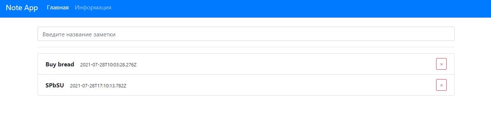

<h1 align="center">NoteApp</h1>
<h2 align="center">

<p align="center"></p>

## Description

**NoteApp with animations**

This application is written on React. Here you can create and delete your notes.

## How to use
- **Write** your note to the panel.
- **When** you complete your reminder, click on the red cross to the right of the note.

## About the project.

### Objectives of the project

- This is one of the first projects which I did on React.
- In this project I tried to learn **Git**, **Markdown**, **Firebase**  and etc.

### Bootstrap

- If you encounter problems installing the project, run it with version 4.x.x.
- The app is not compatible with Bootstrap v.5.x.x!


## Project setup

```
yarn
yarn start
```

## Future scope

- Local database needs to be added
- Synchronization with Firebase